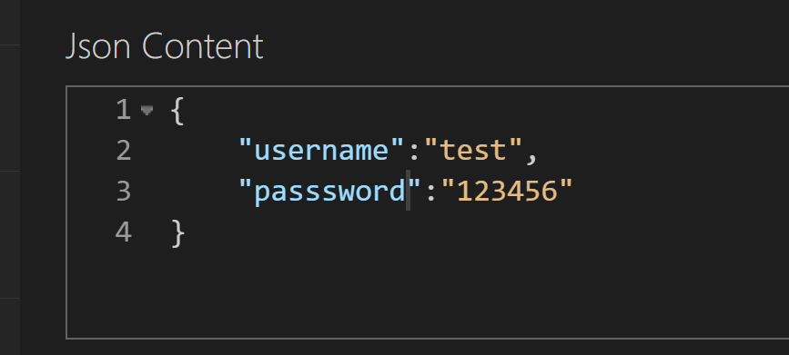
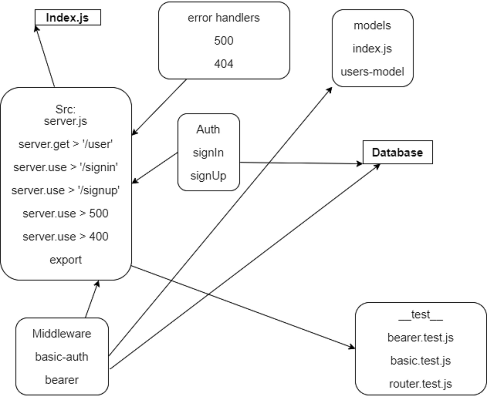

# bearer-auth

## Author

Nedal Al Saleh

## Links

[pull request](https://github.com/Nedal1994/bearer-auth/pull/1)

[npm test](https://github.com/Nedal1994/bearer-auth/runs/4144920637?check_suite_focus=true)

[heruko link]()

## Setup

* .env requirements

  * PORT = 3100
  * DATABASE_URL = postgres://localhost:5432/nedal
  * API_SECRET = pizza

## Running the application

* npm test/nodemon index.js
* Endpoint: /signin
* Endpoint: /signup
* Endpoint: /user

